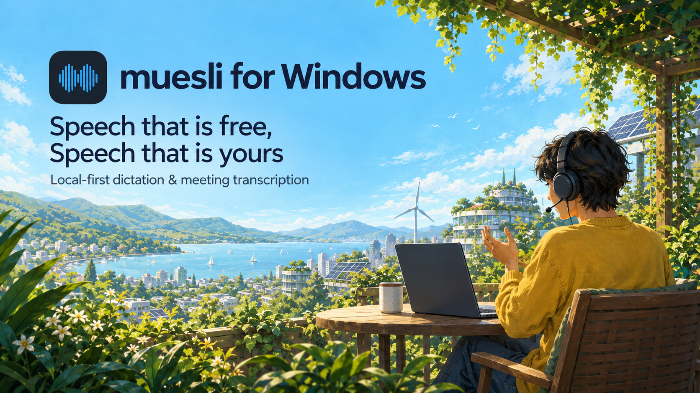

<p align="center">
  
</p>

<h1 align="center">Muesli for Windows</h1>

<p align="center">
  <strong>Local-first dictation and meeting transcription for Windows</strong><br>
  On-device speech-to-text · Native Windows app · Private by default
</p>

<p align="center">
  <a href="#license"></a>
  <a href="https://github.com/Muesli-HQ/muesli-windows/actions/workflows/windows-ci.yml"></a>
  
  
</p>

<p align="center">
  <a href="#features">Features</a> ·
  <a href="#install">Install</a> ·
  <a href="#development">Development</a> ·
  <a href="#privacy">Privacy</a> ·
  <a href="https://github.com/Muesli-HQ/muesli">macOS</a> ·
  <a href="https://github.com/Muesli-HQ/muesli-ios">iOS</a>
</p>

---

## What is Muesli for Windows?

Muesli for Windows brings the same local-first philosophy as [Muesli for macOS](https://github.com/Muesli-HQ/muesli) and [Muesli for iOS](https://github.com/Muesli-HQ/muesli-ios) to a native Windows desktop app. Dictate into the active app, record meetings, transcribe audio, and keep a searchable local library.

Transcription runs on device through native sherpa-onnx models. Meeting summaries run locally by default; OpenAI and OpenRouter are optional when you provide your own API keys.

The shipping shell is **WinUI 3**, packaged with **MSIX**. This repository is currently for source builds, development, and beta qualification. A signed public installer remains a release gate.

### Dictation

Hold your global shortcut → speak → release → the transcript is pasted into the active Windows app. Choose your dictation model in Models, prepare it explicitly, and optionally apply local transcript cleanup or personal dictionary corrections.

### Meeting transcription

Start a recording → capture microphone and meeting audio as separate tracks → transcribe locally → review speaker labels, generate notes, and search or export the saved meeting. Muesli attempts process-targeted audio capture for detected meetings and discloses when it falls back to endpoint loopback.

Live meeting transcription is **off by default**. Nemotron 3.5 is an explicit option with native Silero VAD; downloading a live model never enables it automatically. Long physical-meeting and device-change qualification remain open.

---

## Features

| Feature | What you can do |
|---|---|
| **Dictation** | Speak with a global shortcut and paste the transcript into the active app. |
| **On-device transcription** | Choose seven pinned offline models across Parakeet, Whisper, SenseVoice, Qwen3-ASR, and Cohere. Select dictation and final meeting/import models independently. |
| **Local cleanup** | Use optional Qwen/GGUF models through LLamaSharp to clean up transcripts locally. |
| **Meeting recording** | Capture microphone and meeting audio separately, recover interrupted sessions, and play retained audio. |
| **Live meeting transcript** | Explicitly enable Nemotron 3.5 with native Silero VAD after preparing the model. |
| **Speaker labels** | Run native sherpa-onnx diarization on recorded meeting system audio when models are cached. |
| **Meeting notes** | Generate local summaries, or opt into OpenAI or OpenRouter with your own keys. |
| **Audio imports** | Transcribe recorded audio using the separately selected final meeting/import model. |
| **Local library** | Browse dictations and meetings with search, folders, filters, a personal dictionary, and Markdown export. |

---

## Install

### Beta status

There is no signed public installation path yet. Local development uses the packaged WinApp launch below; package creation alone does not prove installation or release readiness. See [Repository Status](#repository-status) for the remaining gates.

### Build from source

**Requirements**

- Windows x64: Windows 10 22H2 (build 19045) or a current serviced Windows 11 release. Process-targeted loopback requires build 20348 or newer.
- The .NET SDK pinned in [global.json](global.json), currently **10.0.400**.
- **WinApp CLI 0.6 or newer** for packaged activation.
- Developer Mode or an appropriate sideloading policy for development package registration.

From a Windows PowerShell session:

```powershell
git clone https://github.com/Muesli-HQ/muesli-windows.git
cd muesli-windows

# Restore once for a fresh checkout.
dotnet restore .\windows-native\Muesli.Windows.WinUI\Muesli.Windows.WinUI.csproj -p:Platform=x64

# Build the shipping app.
dotnet build .\windows-native\Muesli.Windows.WinUI\Muesli.Windows.WinUI.csproj --no-restore -p:Platform=x64

# Launch with package identity.
powershell -ExecutionPolicy Bypass -File .\scripts\run-windows.ps1 -SkipBuild
```

The launch script opens the production `%APPDATA%\muesli` library. **Do not launch the WinUI executable directly**: package identity is required for activation and Windows integrations. Use `scripts/run-winui-preview.ps1` only when you intentionally want an isolated test profile.

No Python, virtual environment, or external transcription worker is required. Model preparation is an explicit action in Models; selecting a role never downloads a model or silently changes engines.

---

## Permissions and Windows integrations

| Integration | Why |
|---|---|
| **Microphone** | Record speech during dictation and meeting recording. |
| **Meeting audio capture** | Capture the other side of a call after you explicitly start meeting recording. Endpoint-loopback fallback can include unrelated system sounds. |
| **Global shortcut** | Start dictation and deliver text to the active app. |
| **Notifications and indicator** | Show meeting prompts and recording state through the packaged app and its WPF companion. |
| **Network access** | Explicitly download models, or contact an optional cloud summary provider when configured. Transcription itself runs locally. |

---

## Architecture

```text
windows-native/
  Muesli.Windows.WinUI/          Packaged app, pages, view models, and XAML resources
  Muesli.Windows.Core/           Domain, persistence, and transcription behavior
  Muesli.Windows.Platform/       Windows audio, hotkeys, shell, and OS integrations
  Muesli.Windows.Indicator.Wpf/  Floating indicator and meeting-notification companion
  Muesli.Windows.Tests/          Automated regression tests
  Muesli.Windows.UITests/        Interactive Windows UI automation
```

WinUI is the only shipping product shell. The retired WPF product shell has been removed; the WPF indicator companion remains active.

Windows SQLite remains authoritative for persistence. Selected portable text algorithms can use the shared Swift `MuesliCoreABI.dll`, loaded by full path from the application directory. The current [shared-core lock](windows-native/shared-core.lock.json) ships the parity-tested managed fallback; the bridge stays optional until an approved upstream ABI revision is pinned. Swift dictation-store exports are not connected to the live Windows database.

Dictation owns one warm recognizer. Recorded meetings and audio imports share another, selected independently. Switching a role waits for active inference and disposes the previous recognizer.

---

## Tech Stack

| Component | Technology |
|---|---|
| App | C#, .NET 10, WinUI 3, XAML, Inter |
| Packaging and activation | MSIX, Windows App SDK, WinApp CLI |
| Audio | NAudio WASAPI microphone capture, process-tree loopback, disclosed endpoint-loopback fallback |
| Offline ASR | Native sherpa-onnx with ONNX models; packaged CPU provider by default |
| Live ASR and voice activity | Nemotron 3.5 and native Silero VAD via sherpa-onnx |
| Speaker diarization | Native sherpa-onnx ONNX models |
| Transcript cleanup | LLamaSharp / llama.cpp with local GGUF models |
| Text processing | Optional shared Swift MuesliCore ABI; parity-tested managed fallback |
| Storage | Windows SQLite and JSON settings |
| Meeting notes | Local summaries; optional OpenAI or OpenRouter BYOK |
| CI | GitHub Actions, automated tests, unsigned MSIX rehearsal, package inventories |

### Local data

| Data | Location |
|---|---|
| Settings, history, logs, and captures | `%APPDATA%\muesli` |
| Parakeet models | `%USERPROFILE%\.cache\muesli\native-parakeet` |
| Other offline ASR models | `%USERPROFILE%\.cache\muesli\native-asr` |
| Diarization models | `%USERPROFILE%\.cache\muesli\native-diarization` |
| Cleanup models | `%USERPROFILE%\.cache\muesli\native-cleanup` |
| Optional CUDA acceleration pack | `%LOCALAPPDATA%\muesli` |

---

## Repository Status

Muesli for Windows is **0.3.0 beta**. Local development and unsigned packaging are available; signed public distribution and physical-device qualification remain active release work.

- Updates are manual: Muesli does not check for, download, or install updates automatically.
- Muesli does not pause or duck unrelated media while recording ("no interference").
- PDF export is disabled pending a QuestPDF Community-license eligibility decision; Markdown export remains available and PDF must not be advertised.
- Public support/privacy URLs and the production publisher identity are not final; the package is unsigned and carries the development publisher until a signing identity is configured.

### Current limitations

- Supported ASR families use the **packaged CPU provider** by default. The public package **does not claim NVIDIA acceleration** and includes no NVIDIA or DirectML binaries. NVIDIA CUDA is available as an optional, SHA-256-verified acceleration pack downloaded from the pinned sherpa-onnx 1.13.4 release into `%LOCALAPPDATA%\muesli`; it needs a user-supplied CUDA 12 / cuDNN 9 runtime and is only reported active after a real warm-up inference proves it. DirectML is not offered because the pinned sherpa-onnx Windows build has no DirectML execution provider and silently falls back to CPU.
- Local cleanup models are managed from Models → Cleanup with explicit download, SHA-256 verification, retry, cancel, and delete. Qwen cleanup stays disabled in Settings until a model is installed and selected; placing a GGUF manually in the cache still works for existing installs.
- Process-targeted loopback requires Windows build 20348 or newer and a live detected-process ID. When Windows blocks it, Muesli visibly falls back to render-endpoint loopback, which can include unrelated system sounds; mic recording can continue in a disclosed degraded state.
- Preparing a missing model requires an explicit network-backed download. Transcription itself fails closed when the selected role is missing or unverified.
- Live meeting transcription is off by default. The explicit Nemotron 3.5 option has passed packaged Windows real-inference and Silero-boundary qualification; preparing it is network-backed and never enables it automatically. Long physical-meeting, Bluetooth, route-change, CUDA-live, and human multilingual qualification remain open.
- Installer is not code-signed until a signing certificate is configured.

See the [launch ledger](docs/WINDOWS_LAUNCH_LEDGER.md), [release qualification](docs/PHASE5_RELEASE_QUALIFICATION.md), and [roadmap](docs/ROADMAP.md) for detailed status.

---

## Development

Build and open the packaged dashboard after changes:

```powershell
dotnet build .\windows-native\Muesli.Windows.WinUI\Muesli.Windows.WinUI.csproj --no-restore -p:Platform=x64
powershell -ExecutionPolicy Bypass -File .\scripts\run-windows.ps1 -SkipBuild
```

Check the latest `%APPDATA%\muesli\logs\muesli-*.log` for fresh `ERROR`, `Unhandled UI exception`, or `XamlParseException` entries. Build success alone does not verify the UI.

### Tests and qualification

```powershell
dotnet test .\windows-native\Muesli.Windows.Tests\Muesli.Windows.Tests.csproj
```

| Check | Entry point |
|---|---|
| Recorded meeting regressions | [benchmark-native-meeting.ps1](scripts/benchmark-native-meeting.ps1) |
| Media import regressions | [test-media-imports.ps1](scripts/test-media-imports.ps1) |
| Physical meeting-session lifecycle | [qualify-meeting-session-lifecycle.ps1](scripts/qualify-meeting-session-lifecycle.ps1), [qualification matrix](docs/PHASE3_QUALIFICATION.md) |
| Interactive UI automation | [UI test guide](windows-native/Muesli.Windows.UITests/README.md) |
| Packaged release gate | [qualify-windows-release.ps1](scripts/qualify-windows-release.ps1) |

Physical microphone, Bluetooth, route-change, and sleep/recovery checks are part of qualification; automated tests do not replace them.

### Package

```powershell
.\scripts\package-windows-v1.ps1
```

This delegates to the shipping WinUI MSIX packager. For the unsigned release rehearsal, including tests and MSIX smoke checks, see [rehearse-windows-release.ps1](scripts/rehearse-windows-release.ps1). Release qualification records native-runtime, stress, memory, package-hash, signature, and fresh-launch log evidence.

---

## Privacy

Muesli is built around local-only processing. Concretely:

- **Transcription is on-device.** Native sherpa-onnx offline models run in-process. Your audio is never uploaded.
- **Microphone is only active during dictation or meeting recording.** While you hold the dictation hotkey, or while a meeting recording is running, the WASAPI capture stream is open. At every other moment it is closed.
- **System audio loopback is opt-in per meeting.** Loopback (the "other side" of a Zoom / Teams / Meet call) only starts after you explicitly click **Join & Record** on the meeting-detection toast. No silent background capture.
- **The global keyboard hook only inspects key codes.** Muesli installs a `WH_KEYBOARD_LL` hook so the dictation hotkey works in any app. The hook checks whether the pressed key matches your configured shortcut and nothing else — no keystroke content is logged, transmitted, or stored anywhere.
- **Crash reporting is opt-in and off by default.** If you toggle it on (during onboarding or in About → Privacy), stack traces and the app version are sent to Sentry; transcripts, recordings, file paths, and your Windows username are scrubbed before send.
- **Local storage paths.** Settings and history live in `%APPDATA%\muesli\`. Model weights cache to `%USERPROFILE%\.cache\muesli\`. Captured audio files live in `%APPDATA%\muesli\captures\`. Nothing leaves these locations unless you ask it to.
- **Cloud meeting summaries require your own keys.** OpenAI / OpenRouter summary providers are only used when you enter your own API key in Settings. The default summary provider runs locally.

---

## Related

- [Muesli for macOS](https://github.com/Muesli-HQ/muesli) — the original native desktop app and shared Swift core.
- [Muesli for iOS](https://github.com/Muesli-HQ/muesli-ios) — the iPhone companion and keyboard workflows.
- [Windows native development notes](windows-native/README.md).
- [Windows/macOS parity matrix](docs/WINDOWS_MACOS_PARITY_MATRIX.md).

---

## Contributing

Issues and pull requests are welcome. For larger changes, open an issue first to discuss the Windows architecture and product parity.

Priority areas include visual polish, meeting detection reliability, physical audio-device qualification, optional NVIDIA acceleration, and code signing. Reusable nonvisual behavior belongs in Core or Platform; follow the existing WinUI/XAML patterns for the app.

Before opening a PR, build and run the tests, launch the packaged dashboard, and inspect fresh logs. Packaging changes also need the relevant MSIX smoke checks.

---

## Acknowledgements

- NVIDIA Parakeet and Qwen3-ASR
- OpenAI Whisper, SenseVoice, and Cohere Transcribe model artifacts
- sherpa-onnx
- NAudio
- LLamaSharp / llama.cpp
- Inter font family

---

## License

MIT License — free for personal and commercial use.
